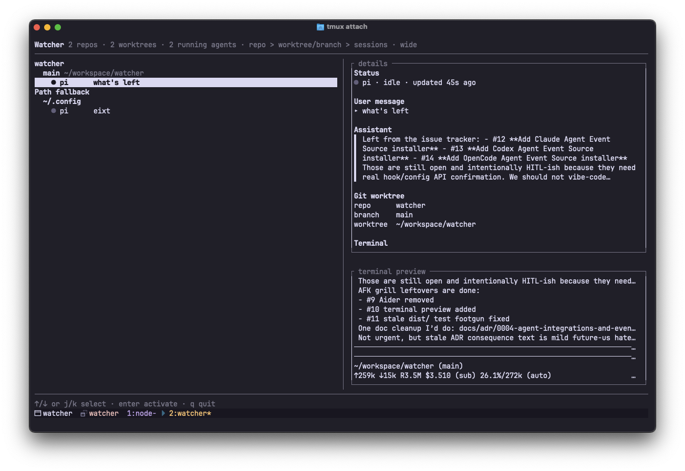

# Watcher

A switcher for local coding agents running in tmux.

Built because I live in the terminal and already use tmux. Watcher is deliberately not trying to reinvent the wheel: tmux already owns windows, panes, sessions, keybindings, and muscle memory. Watcher just shows which agent panes need attention, previews enough context, then jumps straight back into tmux.



```sh
npm install -g @dinhtungdu/watcher
watcher
watcher integrations install pi
```

Tmux binding example:

```tmux
bind -n M-s new-window -n watcher "watcher"
```

This keeps Watcher one keystroke away: `Alt-s` opens the switcher in a tmux window, `j/k` picks an agent, and `Enter` jumps to it.
